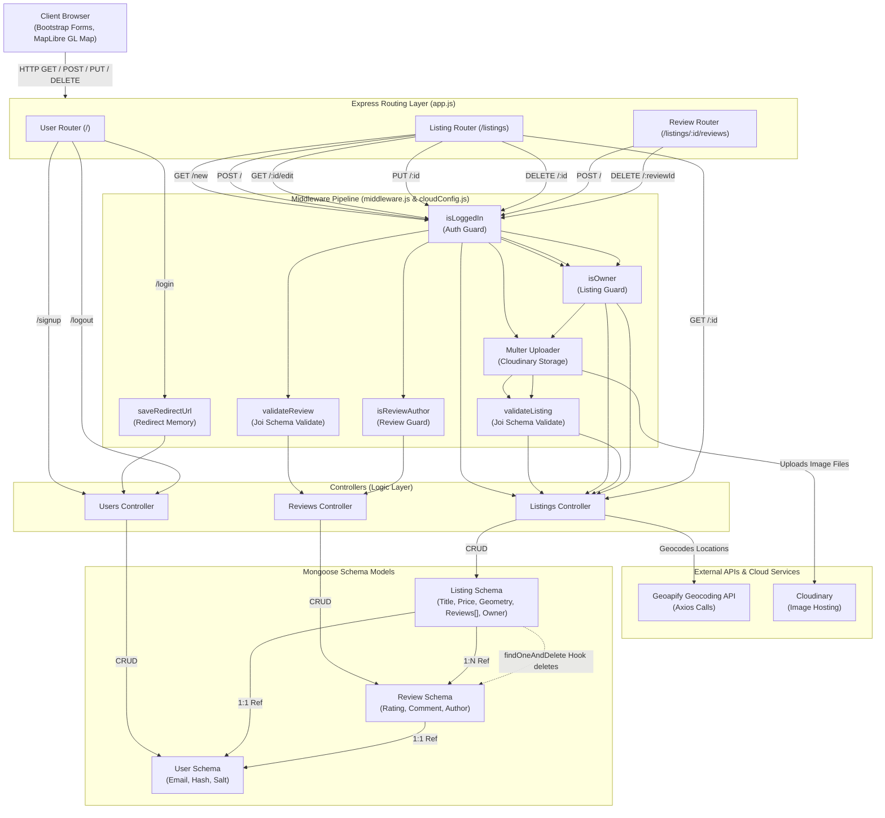

# 🏡 CasarioBnB

[](https://casariobnb.onrender.com/listings)
[](https://nodejs.org)
[](https://expressjs.com)
[](https://www.mongodb.com)
[](https://opensource.org/licenses/ISC)

> **CasarioBnB** is a full-featured, end-to-end full-stack web application that serves as a premium property renting platform (inspired by Airbnb/Wanderlust). Users can explore diverse accommodations around the globe, listing their own rentals, post ratings and reviews, and view precise locations of properties on fully interactive maps.

🔗 **Live Deployment:** [casariobnb.onrender.com/listings](https://casariobnb.onrender.com/listings)

<p align="center">
  <svg width="100%" height="4px" viewBox="0 0 100 1" preserveAspectRatio="none">
    <linearGradient id="theme-grad-1" x1="0" y1="0" x2="100%" y2="0">
      <stop offset="0%" stop-color="#FDFBD4"/>
      <stop offset="33%" stop-color="#D9D7B6"/>
      <stop offset="66%" stop-color="#878672"/>
      <stop offset="100%" stop-color="#545333"/>
    </linearGradient>
    <rect x="0" y="0" width="100" height="1" fill="url(#theme-grad-1)" rx="0.5"/>
  </svg>
</p>

##  Core Features

<table>
  <tr>
    <td width="50%">
      <strong>🔒 Secure Authentication</strong>
      <br><br>
      Session-based signup, login, and logout flow using Passport.js with encrypted credential storage.
    </td>
    <td width="50%">
      <strong>🛠️ Complete Listings CRUD</strong>
      <br><br>
      Create, read, update, and delete property listings. Restricts listing modifications strictly to their owners.
    </td>
  </tr>
  <tr>
    <td>
      <strong> Cloud Media Storage</strong>
      <br><br>
      Integrates Multer & Cloudinary Storage to parse and upload listing cover photos, keeping server storage lightweight.
    </td>
    <td>
      <strong>🗺️ Geoapify Geocoding</strong>
      <br><br>
      Translates textual locations into real GeoJSON coordinate points on creation, saving precise coordinate geometry.
    </td>
  </tr>
  <tr>
    <td>
      <strong>💬 Review & Rating System</strong>
      <br><br>
      Provides an interactive star rating form and comment system for authenticated users to review listed stays.
    </td>
    <td>
      <strong>📍 Interactive MapLibre Maps</strong>
      <br><br>
      Displays listing locations on a customizable interactive MapLibre map centered on the geocoded coordinates.
    </td>
  </tr>
  <tr>
    <td>
      <strong> Schema Validations</strong>
      <br><br>
      Enforces strong server-side validation via Joi schemas alongside custom client-side Bootstrap form checks.
    </td>
    <td>
      <strong>⚡ Cascade Cleanup & Session Store</strong>
      <br><br>
      Automatically clears listing reviews on deletion via Mongoose hooks, backed by connect-mongo session persistence.
    </td>
  </tr>
</table>

<p align="center">
  <svg width="100%" height="4px" viewBox="0 0 100 1" preserveAspectRatio="none">
    <linearGradient id="theme-grad-2" x1="0" y1="0" x2="100%" y2="0">
      <stop offset="0%" stop-color="#FDFBD4"/>
      <stop offset="33%" stop-color="#D9D7B6"/>
      <stop offset="66%" stop-color="#878672"/>
      <stop offset="100%" stop-color="#545333"/>
    </linearGradient>
    <rect x="0" y="0" width="100" height="1" fill="url(#theme-grad-2)" rx="0.5"/>
  </svg>
</p>

##  Tech Stack

### Backend & Database

- **Node.js** with **Express.js** (v5.x framework)
- **MongoDB & Mongoose (ODM)** for schema control
- **Connect-Mongo** for persisting login sessions to the database

### Frontend

- **EJS (Embedded JavaScript)** with **EJS-Mate** for page templates & reusable partial blocks
- **Bootstrap 5** for layout responsiveness
- **FontAwesome** for icons & typography
- **MapLibre GL** for map plotting

### APIs & Integrations

- **Cloudinary v2** (media storage)
- **Geoapify** (Geocoding API & Map Style sheets)
- **Axios** (outbound API requests)

<p align="center">
  <svg width="100%" height="4px" viewBox="0 0 100 1" preserveAspectRatio="none">
    <linearGradient id="theme-grad-3" x1="0" y1="0" x2="100%" y2="0">
      <stop offset="0%" stop-color="#FDFBD4"/>
      <stop offset="33%" stop-color="#D9D7B6"/>
      <stop offset="66%" stop-color="#878672"/>
      <stop offset="100%" stop-color="#545333"/>
    </linearGradient>
    <rect x="0" y="0" width="100" height="1" fill="url(#theme-grad-3)" rx="0.5"/>
  </svg>
</p>

## 📂 Project Architecture

```text
CasarioBnB/
├── app.js                 # App configuration & Server initialization
├── cloudConfig.js         # Cloudinary configuration
├── middleware.js          # Route protection & authorization checks
├── schema.js              # Joi server-side validation schemas
├── controllers/           # MVC Controllers (business logic)
│   ├── listings.js
│   ├── reviews.js
│   └── users.js
├── models/                # Database schemas
│   ├── listing.js
│   ├── review.js
│   └── user.js
├── routes/                # Endpoint routing
│   ├── listing.js
│   ├── review.js
│   └── user.js
├── public/                # Client static assets (CSS/JS)
├── views/                 # HTML UI layouts & templates
└── init/                  # Database seeding script
```

### Request Flow & Components



<p align="center">
  <svg width="100%" height="4px" viewBox="0 0 100 1" preserveAspectRatio="none">
    <linearGradient id="theme-grad-4" x1="0" y1="0" x2="100%" y2="0">
      <stop offset="0%" stop-color="#FDFBD4"/>
      <stop offset="33%" stop-color="#D9D7B6"/>
      <stop offset="66%" stop-color="#878672"/>
      <stop offset="100%" stop-color="#545333"/>
    </linearGradient>
    <rect x="0" y="0" width="100" height="1" fill="url(#theme-grad-4)" rx="0.5"/>
  </svg>
</p>

## 🛠️ Getting Started

Follow these instructions to run the project locally on your machine.

### Prerequisites

Make sure you have installed:

- [Node.js](https://nodejs.org/) (v18 or higher)
- [MongoDB](https://www.mongodb.com/) (either running locally or a MongoDB Atlas account)

### Setup & Installation

1.  **Clone the repository:**

    ```bash
    git clone https://github.com/IvySingh-1/CasarioBnB.git
    cd CasarioBnB
    ```

2.  **Install dependencies:**

    ```bash
    npm install
    ```

3.  **Configure Environment Variables:**
    Create a `.env` file in the root directory and specify the following keys:

    ```env
    # Database
    ATLASDB_URL="your-mongodb-connection-string"
    SECRET="your-session-secret"

    # Cloudinary Integration
    CLOUD_NAME="your-cloudinary-name"
    CLOUD_API_KEY="your-cloudinary-api-key"
    CLOUD_API_SECRET="your-cloudinary-api-secret"

    # Mapping Service Integration
    MAP_TOKEN="your-geoapify-api-token"
    ```

4.  **Seed the Database (Optional):**
    If you want to initialize the database with pre-populated listings:

    ```bash
    node init/index.js
    ```

5.  **Run the Server:**
    ```bash
    node app.js
    ```
    Your application will start and be accessible at [http://localhost:8080](http://localhost:8080).

<p align="center">
  <svg width="100%" height="4px" viewBox="0 0 100 1" preserveAspectRatio="none">
    <linearGradient id="theme-grad-5" x1="0" y1="0" x2="100%" y2="0">
      <stop offset="0%" stop-color="#FDFBD4"/>
      <stop offset="33%" stop-color="#D9D7B6"/>
      <stop offset="66%" stop-color="#878672"/>
      <stop offset="100%" stop-color="#545333"/>
    </linearGradient>
    <rect x="0" y="0" width="100" height="1" fill="url(#theme-grad-5)" rx="0.5"/>
  </svg>
</p>

<div align="center">

Thank you for exploring this project.

⭐ **If you found value in it, consider starring the repository.**

<br>

Developed by **Ivy Singh**

 [ivysingh99@gmail.com](mailto:ivysingh99@gmail.com)
🔗 [LinkedIn](https://www.linkedin.com/in/ivysingh99/)

</div>
